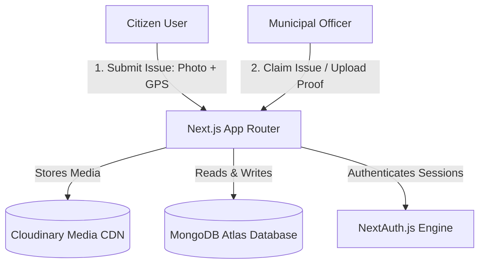

# CivicFix | Crowdsourced Civic Issue Reporting Platform

[-black.svg)](https://nextjs.org/)
[](https://tailwindcss.com/)
[](https://www.mongodb.com/)
[](https://next-auth.js.org/)
[](https://cloudinary.com/)
[](https://civic-fix-pi.vercel.app/)

**CivicFix** is a state-of-the-art crowdsourced civic issue reporting platform built to close the gap between active citizens and local municipal authorities. Citizens can report local concerns (potholes, garbage, broken streetlights) with geolocated photos. Municipal officers can then claim, manage, and resolve these issues in real-time, uploading visual proof of completion.

---

## 📌 Table of Contents

- [Core Features](#-core-features)
- [System Architecture](#-system-architecture)
- [User Roles & Permissions](#-user-roles--permissions)
- [Folder Structure](#-folder-structure)
- [Getting Started](#-getting-started)
- [Database & Media Setup](#-database--media-setup)
- [Deployment (Vercel)](#-deployment-vercel)

---

## ✨ Core Features

- **📍 Geolocated Issue Mapping**: Live interactive maps powered by **React-Leaflet** allow citizens to pinpoint the exact location of civic issues with GPS coordinates.
- **📸 Media Attachment (Cloudinary)**: Citizens take or upload photos of issues. The media is stored in the cloud using **Cloudinary** for fast CDN delivery.
- **🛡️ Secure Role-Based Authentication**: Implemented with **NextAuth.js**, isolating standard **Citizens** from municipal **Officers**.
- **👷 Officer Claims Workflow**: Officers can browse nearby reported issues, "claim" them for remediation, and eventually "resolve" them by posting "fixed" photos.
- **📊 Officer Insights Hub**: Dedicated dashboard showcasing real-time activity metrics, resolved vs. open issues, and performance charts.
- **🔄 Status Lifecycle**: Real-time visual status updates (🔴 **Open** ──► 🟡 **Claimed** ──► 🟢 **Resolved**).

---

## 🏗️ System Architecture



### Flow of Issue Resolution:
1. **Citizen** spots an issue, fills a form, uploads a photo, and clicks on the map to pin the GPS location.
2. The issue is saved in **MongoDB** under an `Open` status.
3. An **Officer** logs in, accesses their dashboard, and views active pins or tables of open issues.
4. The officer clicks **Claim Issue** (updating status to `Claimed` with the officer's ID attached).
5. Once fixed, the officer uploads a "resolution photo" and marks the issue as **Resolved** (status `Fixed`).
6. The public map updates instantly to reflect the solved status!

---

## 👥 User Roles & Permissions

| Feature | Citizen | Municipal Officer |
| :--- | :---: | :---: |
| View Public Live Map | ✅ | ✅ |
| Submit New Issue (Photo + Location) | ✅ | ❌ |
| Claim Open Issues | ❌ | ✅ |
| Resolve Issues & Upload Proof | ❌ | ✅ |
| View Officer Performance Metrics | ❌ | ✅ |

---

## 📂 Folder Structure

```
civicfix/
├── app/                  # Next.js 14 App Router pages and API routes
│   ├── api/              # API endpoints for Issues, Claims, and Authentication
│   ├── layout.tsx        # Base page layout & Leaflet Map CSS imports
│   └── page.tsx          # Main entry (interactive dashboard & map)
├── components/           # Reusable UI elements (Map, Forms, Navbar, Cards)
├── lib/                  # Helper modules (MongoDB Connection utility)
├── models/               # Mongoose schema definitions (User, Issue, ClickEvent)
├── tailwind.config.ts    # Custom Tailwind styling & theme configurations
└── tsconfig.json         # TypeScript configuration
```

---

## 🚀 Getting Started

### 📋 Prerequisites
- **Node.js 18.x** or higher installed.
- **npm** or **yarn** package manager.
- A **MongoDB Atlas** database account or a local running instance.
- A **Cloudinary** developer account.

### ⚙️ Local Installation & Setup

1. **Clone the repository**:
   ```bash
   git clone https://github.com/Sundhar004/CivicFix.git
   cd civicfix
   ```

2. **Install project dependencies**:
   ```bash
   npm install
   ```

3. **Configure Environment Variables**:
   Create a `.env.local` file in the root of the project using the `.env.local.example` structure:
   ```env
   # MongoDB Atlas Connection String
   MONGODB_URI=mongodb+srv://<username>:<password>@cluster0.xxxxx.mongodb.net/civicfix_db?retryWrites=true&w=majority

   # NextAuth Authentication Config
   NEXTAUTH_SECRET=your_nextauth_jwt_secret_key
   NEXTAUTH_URL=http://localhost:3000

   # Cloudinary Media Storage Configurations
   CLOUDINARY_CLOUD_NAME=your_cloudinary_cloud_name
   CLOUDINARY_API_KEY=your_cloudinary_api_key
   CLOUDINARY_API_SECRET=your_cloudinary_api_secret
   ```

4. **Launch the development server**:
   ```bash
   npm run dev
   ```

5. Open your browser and navigate to:
   👉 **[http://localhost:3000](http://localhost:3000)**

---

## ☁️ Deployment (Vercel)

This application is ready to deploy directly to **Vercel** with a few simple steps:

1. Push your latest code changes to your GitHub branch.
2. Link your repository in the Vercel Dashboard.
3. Configure the exact environmental keys (as defined in `.env.local`) in the **Vercel Environment Variables** settings panel.
4. Set the `NEXTAUTH_URL` variable to your production domain (e.g. `https://civic-fix-pi.vercel.app`).
5. Click **Deploy**!

---

> [!IMPORTANT]
> **Database Notice**: This application has successfully transitioned from Supabase to **MongoDB**. Please make sure that your Mongo Atlas cluster is whitelisted to accept connections from all IPs (`0.0.0.0/0`) if deploying to Vercel, to prevent serverless database handshake timeouts!

---

## 📄 License
Academic and open-source licensing guidelines apply. Built for positive community impact!
